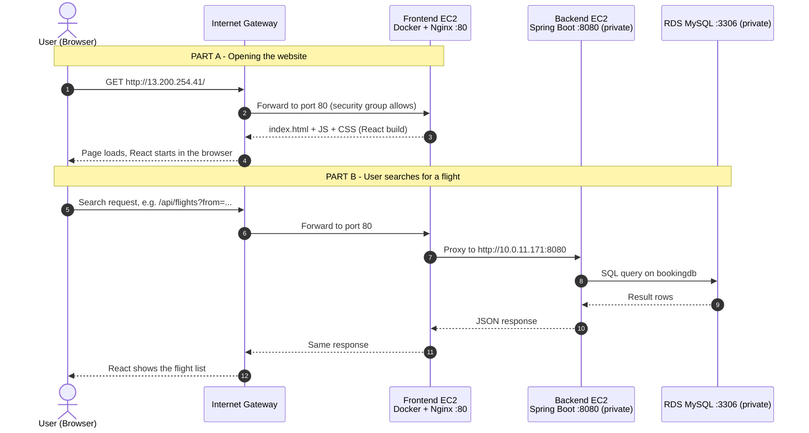
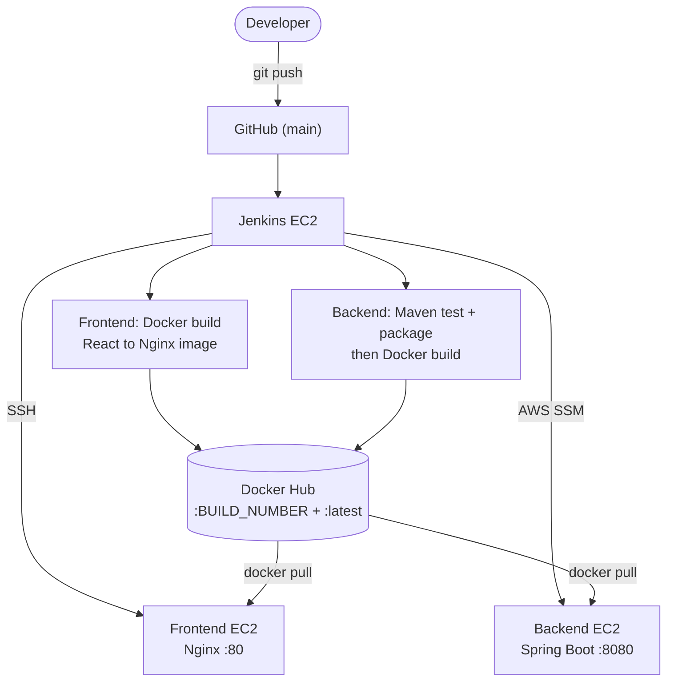
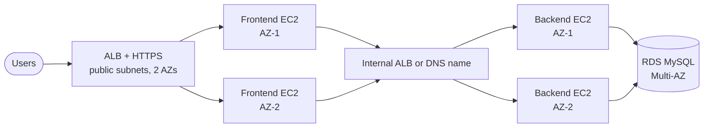
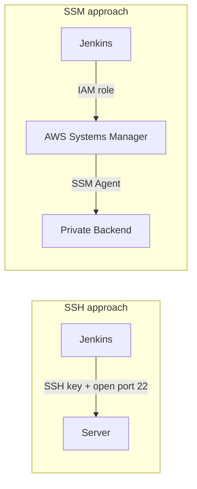

<h1 align="center">✈️ FlightFinder</h1>
<h3 align="center">Full-Stack AWS Project · Live Request Flow · CI/CD Runbook</h3>

<p align="center">
  
  
  
  
  
  
  
  
  
</p>

<p align="center">
  
</p>

| | Frontend | Backend |
|---|---|---|
| **Repository** | [`-FlightFinder-frontend-React`](https://github.com/ajaydhadi95-gif/-FlightFinder-frontend-React.git) | [`FlightFinder-Application_backend`](https://github.com/ajaydhadi95-gif/FlightFinder-Application_backend.git) |
| **Tech** | React (Vite), Node 22 build, Nginx | Java 21, Spring Boot, Maven |
| **Docker image** | `ajaydhadi95/flightfinder-frontend` | `ajaydhadi95/flightfinder-backend` |
| **Runs on** | Frontend EC2, **public** subnet, port `80` | Backend EC2, **private** subnet, port `8080` |
| **Deployed by Jenkins via** | SSH | AWS Systems Manager (SSM) |
| **Maintainer** | [@ajaydhadi95-gif](https://github.com/ajaydhadi95-gif) | |
| **Region** | `ap-south-1` · VPC `10.0.0.0/16` | |
| **Document updated** | 2026-10-07 | |

---

## 📑 Table of Contents

| Part | Sections |
|---|---|
| **Understand it** | [1. Explained simply](#1-the-project-explained-simply) · [2. Status at a glance](#2-status-at-a-glance) |
| **How it works** | [3. Architecture](#3-architecture) · [4. Live user request: coming in and going out](#4-live-user-request-coming-in-and-going-out) · [5. CI/CD flow](#5-cicd-flow) |
| **Reference** | [6. Inventory](#6-inventory) · [7. Infrastructure as Code (Terraform)](#7-infrastructure-as-code-terraform) · [8. One-time setup](#8-one-time-setup) |
| **Operate it** | [9. Deploy](#9-deploy-a-change) · [10. Verify](#10-verify-a-deployment) · [11. Rollback](#11-rollback) · [12. Daily operations](#12-daily-operations) |
| **Protect it** | [13. Security](#13-security) · [14. Monitoring](#14-monitoring--alerting) · [15. Backup & recovery](#15-backup--disaster-recovery) |
| **Fix it** | [16. Incident playbooks](#16-incident-playbooks) · [17. Issues already solved](#17-issues-already-solved) |
| **Grow it** | [18. Roadmap](#18-roadmap) · [19. Interview explanation](#19-interview-explanation) · [20. FAQ](#20-faq) · [21. Appendix](#21-appendix) |

---

## 1. The Project Explained Simply

> **In one sentence:** FlightFinder is a flight-search website. Visitors use a **public frontend** (React served by Nginx). Behind it sits a **private backend** (Spring Boot) and a **private database** (MySQL). Whenever a developer pushes code, **Jenkins** automatically builds, packs and delivers it to the right server.

<p align="center">
  
</p>

### Words you will see in this document

| Word | Plain-English meaning |
|---|---|
| **Frontend** | The part users see and click: pages, search box, results. |
| **React / Vite** | Tools used to write and build the frontend. |
| **Nginx** | A fast web server. It hands the website files to the browser. |
| **Backend** | The "brain": receives requests (search flights) and returns answers. |
| **Spring Boot** | The Java framework the backend uses. |
| **Database (RDS MySQL)** | Where flight and booking data is stored permanently. |
| **AWS / EC2** | Amazon's cloud / a rented server inside it. |
| **VPC** | Our private network inside AWS, like a fenced compound. |
| **Public subnet** | The part of the compound facing the street (internet). |
| **Private subnet** | The part with no door to the street. Backend and database live here. |
| **Internet Gateway** | The front gate of the compound. |
| **NAT Gateway** | A one-way exit so private servers can reach the internet (updates, Docker Hub) without being reachable from it. |
| **Docker image / container** | A sealed box with the app and everything it needs. Image = the blueprint, container = the running box. |
| **Docker Hub** | Online warehouse for our Docker images. Each version is numbered (`:4`, `:5`...). |
| **Jenkins** | The robot that tests, builds and ships our code (CI/CD). |
| **SSH / SSM** | Two ways to run commands on a server remotely. SSH uses a key. SSM uses AWS permissions, with no key and no open port. |
| **Security group** | A firewall around each server. It lists exactly who may knock on which port. |
| **Terraform** | Describes the whole AWS setup as code, so it can be rebuilt on demand. |

---

## 2. Status at a Glance

| Area | Status | Notes |
|---|---|---|
| Frontend pipeline (4 stages) | ✅ Live | Build #4 `Finished: SUCCESS` |
| Backend pipeline (6 stages) | ✅ Live | Build #4 `Finished: SUCCESS` |
| Frontend served on port 80 | ✅ Live | `http://13.200.254.41` |
| Backend private on `:8080` | ✅ Live | No public IP, deployed via SSM |
| RDS MySQL private on `:3306` | ✅ Live | Database `bookingdb` |
| **Frontend → Backend API link** | ⚠️ **Confirm** | The shared Dockerfile uses stock Nginx with **no `/api` proxy**. See [section 4.4](#44-important-how-does-the-browser-reach-the-private-backend) |
| HTTPS | 🔜 Missing | Port 443 is open in the security group, but Nginx listens on 80 only |
| Automated tests | ⚠️ None yet | Backend: `No tests to run` |
| Load balancer / high availability | 🔜 Planned | Single frontend and single backend today |
| Monitoring and alarms | 🔜 Recommended | See [section 14](#14-monitoring--alerting) |

---

## 3. Architecture

<p align="center">
  
</p>

*Solid lines = in place per your runbooks and Terraform plan. Dashed line = needs confirmation.*

### Network layout

| Tier | Subnet | What lives here | Internet exposure |
|---|---|---|---|
| **Public** | `10.0.1.0/24` | Frontend EC2 (`10.0.1.233`), Jenkins EC2, NAT Gateway | Yes |
| **Private application** | `10.0.11.0/24` | Backend EC2 (`10.0.11.171`) | No |
| **Private database** | `10.0.21.0/24`, `10.0.22.0/24` | RDS MySQL | No |

### Security groups (from the Terraform plan)

| Security group | Inbound | From | Verdict |
|---|---|---|---|
| `terraform-frontend-sg` | `80`, `443` | `0.0.0.0/0` | ✅ Correct for a public website |
| `terraform-frontend-sg` | `22` (SSH) | `0.0.0.0/0` | ⚠️ Restrict to the Jenkins server only |
| `terraform-backend-sg` | `8080` | Frontend security group | ✅ Only the frontend can reach the backend |
| `terraform-rds-sg` | `3306` | Backend security group | ✅ Only the backend can reach the database |

> [!NOTE]
> Each layer accepts traffic **only from the layer in front of it**. A visitor can never talk to the backend or the database directly.

---

## 4. Live User Request: Coming In and Going Out

### 4.1 The journey at a glance

<p align="center">
  
</p>



### 4.2 Step-by-step: request IN

| # | What happens | Where | Port | What protects it |
|---|---|---|---|---|
| 1 | User types the address or taps a link. The browser sends an HTTP request. | User's device | 80 / 443 | n/a |
| 2 | The request reaches AWS through the **Internet Gateway**. | VPC edge | 80 / 443 | Route table: public subnet only |
| 3 | It arrives at the **Frontend EC2**. The security group checks the port. | Public subnet `10.0.1.0/24` | 80 | `terraform-frontend-sg` |
| 4 | **Nginx** (inside the Docker container) answers. Page requests get the React files. API requests are forwarded to the backend. | Frontend container | 80 | Container isolation |
| 5 | Nginx calls the **Backend EC2** over the private network. | Private subnet `10.0.11.0/24` | 8080 | `terraform-backend-sg`: frontend only |
| 6 | **Spring Boot** applies the business rules and queries the database. | Backend container | 3306 | `terraform-rds-sg`: backend only |

### 4.3 Step-by-step: response OUT

| # | What happens | Where |
|---|---|---|
| 7 | MySQL returns the matching rows to Spring Boot. | Private DB subnet |
| 8 | Spring Boot turns them into **JSON** and replies to Nginx. | Private app subnet |
| 9 | Nginx returns the response to the Internet Gateway. | Public subnet |
| 10 | The browser receives it and **React draws the flight list** on screen. | User's device |

> [!TIP]
> The user only ever sees **one address**: the frontend. The backend IP `10.0.11.171` and the database endpoint are never exposed to the internet.

### 4.4 Important: how does the browser reach the private backend?

React runs **in the user's browser**, not on the server. A browser on the internet **cannot** call `http://10.0.11.171:8080` because that is a private address. So the backend can only be reached if **Nginx forwards `/api` calls to it** (a "reverse proxy"). The security group `terraform-backend-sg` ("allow backend traffic from frontend") shows this was the intended design.

The `Dockerfile` in your frontend runbook copies only the React build into stock Nginx, so there is **no proxy rule yet**. Please confirm how your React code calls the API. If it uses a private IP or `localhost`, requests will fail in a real browser.

**Recommended fix**

1. Add `nginx.conf` to the frontend repo:

```nginx
server {
    listen 80;
    server_name _;
    root /usr/share/nginx/html;
    index index.html;

    # React single-page app: unknown paths fall back to index.html
    location / {
        try_files $uri /index.html;
    }

    # API calls go to the private backend (adjust the path to match your controllers)
    location /api/ {
        proxy_pass http://10.0.11.171:8080/;
        proxy_set_header Host              $host;
        proxy_set_header X-Real-IP         $remote_addr;
        proxy_set_header X-Forwarded-For   $proxy_add_x_forwarded_for;
        proxy_set_header X-Forwarded-Proto $scheme;
    }
}
```

2. Add one line to the production stage of the frontend `Dockerfile`:

```dockerfile
COPY nginx.conf /etc/nginx/conf.d/default.conf
```

3. In the React code, call the API with a **relative** path such as `/api/...` (not an IP address), then push to `main`.

> [!WARNING]
> `10.0.11.171` is hard-coded in the proxy. If the backend is ever replaced, its private IP may change. Once the architecture grows, point Nginx at an internal load balancer or DNS name instead.

---

## 5. CI/CD Flow

How a code change reaches production, with nobody logging in to a server by hand:

<p align="center">
  
</p>

<p align="center">
  
</p>

### Frontend pipeline

| # | Stage | What it does |
|---|---|---|
| 1 | **Checkout** | Clone `main` from the frontend GitHub repo |
| 2 | **Docker Build** | Multi-stage build: Node 22 runs `npm ci` + `npm run build`, then the `dist/` files are copied into `nginx:alpine`. Tags `:BUILD_NUMBER` and `:latest` |
| 3 | **Docker Push** | Login with `dockerhub-credentials`, push both tags |
| 4 | **Deploy to Frontend EC2** | SSH (`frontend-ec2-ssh`), then `docker pull`, stop and remove the old container, `docker run -d --restart unless-stopped -p 80:80` |

### Backend pipeline

| # | Stage | What it does |
|---|---|---|
| 1 | **Checkout** | Clone `main` from the backend GitHub repo |
| 2 | **Maven Build & Test** | `chmod +x mvnw && ./mvnw clean test` (no tests yet) |
| 3 | **Package JAR** | `./mvnw clean package -DskipTests` → `target/backend-0.0.1-SNAPSHOT.jar` |
| 4 | **Docker Build** | Multi-stage (JDK 21 build, JRE 21 runtime, non-root `appuser`). Tags `:BUILD_NUMBER` and `:latest` |
| 5 | **Docker Login & Push** | Push both tags to Docker Hub |
| 6 | **Deploy via SSM** | `aws ssm send-command` runs pull, stop, remove, `docker run -p 8080:8080` on the private backend |



---

## 6. Inventory

### Frontend

| Item | Value |
|---|---|
| Repository | `https://github.com/ajaydhadi95-gif/-FlightFinder-frontend-React.git` (branch `main`) |
| Image | `ajaydhadi95/flightfinder-frontend` (example tag `:4`, also `:latest`) |
| Container name | `flightfinder-frontend` |
| EC2 public IP / private IP | `13.200.254.41` / `10.0.1.233` |
| Application URL | `http://13.200.254.41` |
| Port | `80` |
| Jenkins credentials | `dockerhub-credentials` (Docker Hub **access token**), `frontend-ec2-ssh` (SSH key, user `ubuntu`) |
| Dockerfile | Stage 1 `node:22-alpine`, stage 2 `nginx:alpine`, files copied to `/usr/share/nginx/html` |

### Backend

| Item | Value |
|---|---|
| Repository | `https://github.com/ajaydhadi95-gif/FlightFinder-Application_backend.git` (branch `main`) |
| Image | `ajaydhadi95/flightfinder-backend` (example tag `:4`, also `:latest`) |
| Container name | `flightfinder-backend` |
| EC2 instance ID / private IP | `i-04e08bcedc0870665` / `10.0.11.171` |
| Port | `8080` |
| Jenkins IAM role | `jenkins-ec2-role` |
| Docker on backend | `29.1.3` |
| Dockerfile | `eclipse-temurin:21-jdk-alpine` build, `21-jre-alpine` runtime, non-root `appuser` |
| Deployed commit | `626c867611e620953ac297a4ceff05c952db822c` |

### Database and platform

| Item | Value |
|---|---|
| Database | RDS MySQL 8.0 · port `3306` · database `bookingdb` · identifier `devops-mysql` |
| Jenkins workspaces | `/var/lib/jenkins/workspace/flightfinder-Backend` (backend job) |
| Region | `ap-south-1` |

---

## 7. Infrastructure as Code (Terraform)

The `terraform plan` you shared is organised into modules: `vpc`, `security_group`, `ec2`, `iam` and `rds`. It reported `Plan: 26 to add, 0 to change, 0 to destroy`.

| Module | Resources created |
|---|---|
| **vpc** | VPC `10.0.0.0/16`, Internet Gateway, NAT Gateway + Elastic IP, public / private / database route tables and associations, subnets: public `10.0.1.0/24`, private `10.0.11.0/24`, database `10.0.21.0/24` and `10.0.22.0/24` |
| **security_group** | `terraform-frontend-sg`, `terraform-backend-sg`, `terraform-rds-sg` |
| **ec2** | `frontend-ec2-1` and `backend-ec2-1`, both `t3.medium` in `ap-south-1a`, key pair `Dhadi` |
| **iam** | Role `terraform-ssm-role` with `AmazonSSMManagedInstanceCore`, instance profile `terraform-ssm-instance-profile` (attached to the backend; the frontend shows `known after apply`, so confirm it is attached too) |
| **rds** | MySQL 8.0 `db.t3.micro`, 20 GB `gp3`, storage encrypted, 7-day backups, not publicly accessible, subnet group `terraform-rds-subnet-group` |

```bash
terraform init
terraform validate
terraform plan -out=tfplan
terraform apply tfplan
```

> [!IMPORTANT]
> **The plan output shown had not been applied.** Applying it creates **new** resources with new IDs and IPs, so values in [section 6](#6-inventory) would change. Update this document after any apply.

**Things to know before applying to a real environment**

| Finding in the plan | Why it matters | Suggested change |
|---|---|---|
| One public and one private subnet only (`10.0.1.0/24`, `10.0.11.0/24`) | The earlier backend runbook lists two of each (`10.0.2.0/24`, `10.0.12.0/24`). A load balancer and high availability need a second AZ. | Add the second public and private subnets when you add an ALB |
| `multi_az = false` | One database instance is a single point of failure | Set `multi_az = true` for production |
| `skip_final_snapshot = true`, `deletion_protection = false` | A `terraform destroy` or console delete would drop the data with no snapshot | Set `deletion_protection = true` and `skip_final_snapshot = false` |
| `SSH 22` open to `0.0.0.0/0` on the frontend | Anyone on the internet can try to log in | Allow only the Jenkins server IP, or move to SSM |
| Egress `0.0.0.0/0` on all groups | Normal for a start, wide for production | Tighten once traffic patterns are known |

> [!WARNING]
> Never commit `terraform.tfstate`, `*.tfvars` or the database password. The plan shows the DB username and password as `(sensitive value)`. Keep them in a secrets store or an untracked `terraform.tfvars`, and use a remote encrypted state (S3 + DynamoDB lock).

---

## 8. One-Time Setup

Already completed. Kept here so the environment can be rebuilt.

<details>
<summary><b>8.1 Jenkins server (shared by both pipelines)</b></summary>

Needs Java 21, Git, Docker, AWS CLI and Jenkins.

```bash
java -version && git --version && docker --version && aws --version
sudo systemctl status jenkins            # active (running)
sudo -u jenkins docker ps                # Jenkins must be able to use Docker
```

If Docker permission is denied:

```bash
sudo usermod -aG docker jenkins
sudo systemctl restart jenkins
```
</details>

<details>
<summary><b>8.2 Jenkins credentials</b></summary>

| ID | Type | Contents |
|---|---|---|
| `dockerhub-credentials` | Username with password | Username `ajaydhadi95`, password = Docker Hub **access token** |
| `frontend-ec2-ssh` | SSH username with private key | User `ubuntu`, private key stored **only** inside Jenkins |

Never put tokens or private keys in a Jenkinsfile or GitHub.
</details>

<details>
<summary><b>8.3 Frontend EC2: Docker and SSH key</b></summary>

```bash
docker --version
sudo systemctl enable docker && sudo systemctl start docker
```

On the Jenkins EC2, generate a key pair and add the public key to the frontend's `~/.ssh/authorized_keys`:

```bash
ssh-keygen -t ed25519 -C "jenkins-frontend-deploy"
```

Test before running the pipeline:

```bash
ssh -i ~/.ssh/id_ed25519 ubuntu@13.200.254.41
```
</details>

<details>
<summary><b>8.4 Frontend .dockerignore</b></summary>

```text
node_modules
dist
.git
.gitignore
README.md
Dockerfile
.dockerignore
```
</details>

<details>
<summary><b>8.5 Backend: IAM role, SSM and Docker</b></summary>

Attach `jenkins-ec2-role` to the Jenkins EC2, then confirm:

```bash
aws sts get-caller-identity
```

Required SSM permissions:

```text
ssm:SendCommand
ssm:GetCommandInvocation
ssm:ListCommandInvocations
ssm:ListCommands
ssm:DescribeInstanceInformation
```

The backend EC2 must show **Online** in Systems Manager, with Docker installed:

```bash
docker --version               # 29.1.3
systemctl is-active docker     # active
```
</details>

<details>
<summary><b>8.6 Backend Git cleanup</b></summary>

An accidental `bin/` folder with `.class` files was untracked:

```bash
git rm -r --cached bin
```

`.gitignore`:

```text
target/
bin/
*.class
```
</details>

---

## 9. Deploy a Change

**Normal deployment = push to `main`.** Then run the matching Jenkins job.

```bash
git add .
git commit -m "Describe your change"
git push origin main
```

1. Open the Jenkins job for the app you changed and watch every stage turn green.
2. Note the **build number**. It is the new image tag.
3. Run the checks in [section 10](#10-verify-a-deployment).

**What Jenkins runs on the frontend EC2 (over SSH)**

```bash
docker pull ajaydhadi95/flightfinder-frontend:${IMAGE_TAG}
docker stop flightfinder-frontend || true
docker rm   flightfinder-frontend || true
docker run -d --restart unless-stopped --name flightfinder-frontend \
  -p 80:80 ajaydhadi95/flightfinder-frontend:${IMAGE_TAG}
docker ps
```

**What Jenkins runs on the backend EC2 (through SSM)**

```bash
docker pull ajaydhadi95/flightfinder-backend:${IMAGE_TAG}
docker stop flightfinder-backend || true
docker rm   flightfinder-backend || true
docker run -d --name flightfinder-backend --restart unless-stopped \
  -p 8080:8080 ajaydhadi95/flightfinder-backend:${IMAGE_TAG}
```

> [!NOTE]
> On the very first deploy you will see `No such container`. That is **expected**: `|| true` lets the deploy continue when there is no old container.

---

## 10. Verify a Deployment

### Frontend

```bash
ssh ubuntu@13.200.254.41
docker ps                          # flightfinder-frontend Up, 0.0.0.0:80->80/tcp
docker images                      # tags :<build number> and :latest present
docker logs flightfinder-frontend  # no errors
```

Open `http://13.200.254.41` in a browser. The FlightFinder React app should load.

### Backend (private, so use SSM from the Jenkins EC2)

```bash
aws ssm send-command \
  --instance-ids "i-04e08bcedc0870665" \
  --document-name "AWS-RunShellScript" \
  --parameters 'commands=["docker ps","docker logs --tail 50 flightfinder-backend"]' \
  --region ap-south-1
```

```bash
aws ssm get-command-invocation \
  --command-id "COMMAND_ID" \
  --instance-id "i-04e08bcedc0870665" \
  --region ap-south-1
```

### End-to-end check

- [ ] Jenkins build `Finished: SUCCESS` for the job you ran
- [ ] Frontend container `Up`, port `80` mapped
- [ ] Backend container `Up`, logs show Spring Boot started, **no database errors**
- [ ] Website opens in a browser
- [ ] A **search in the browser** returns results (this proves frontend → backend → database)
- [ ] Browser developer tools show the `/api` request with status `200`

```bash
# From the frontend EC2 or Jenkins EC2 (inside the VPC), test the backend directly:
curl -i http://10.0.11.171:8080/<API-ENDPOINT>
```

---

## 11. Rollback

Every build is stored in Docker Hub under its build number, so going back means **re-deploying a previous good tag**. Always use a numbered tag, never `latest`.

### Frontend (SSH)

```bash
ssh ubuntu@13.200.254.41
PREV_TAG=<PREVIOUS_GOOD_TAG>
docker pull ajaydhadi95/flightfinder-frontend:${PREV_TAG}
docker stop flightfinder-frontend && docker rm flightfinder-frontend
docker run -d --restart unless-stopped --name flightfinder-frontend \
  -p 80:80 ajaydhadi95/flightfinder-frontend:${PREV_TAG}
docker ps
```

### Backend (SSM, from the Jenkins EC2)

```bash
PREV_TAG=<PREVIOUS_GOOD_TAG>

aws ssm send-command \
  --instance-ids "i-04e08bcedc0870665" \
  --document-name "AWS-RunShellScript" \
  --comment "Rollback to ${PREV_TAG}" \
  --parameters "commands=[\"docker pull ajaydhadi95/flightfinder-backend:${PREV_TAG}\",\"docker stop flightfinder-backend || true\",\"docker rm flightfinder-backend || true\",\"docker run -d --name flightfinder-backend --restart unless-stopped -p 8080:8080 ajaydhadi95/flightfinder-backend:${PREV_TAG}\"]" \
  --region ap-south-1
```

Then repeat the checks in [section 10](#10-verify-a-deployment) and fix the problem on a branch. Do not leave `main` broken.

> [!TIP]
> If a release changed **both** apps, roll back both. A new frontend can depend on a new backend API, and the reverse.

---

## 12. Daily Operations

| Task | Frontend (SSH on `13.200.254.41`) | Backend (inside `commands=[...]` of an SSM call) |
|---|---|---|
| Is it running? | `docker ps` | `"docker ps"` |
| Recent logs | `docker logs --tail 100 flightfinder-frontend` | `"docker logs --tail 100 flightfinder-backend"` |
| Follow logs live | `docker logs -f flightfinder-frontend` | not suited to SSM, use `--tail` repeatedly |
| Restart | `docker restart flightfinder-frontend` | `"docker restart flightfinder-backend"` |
| Which version runs? | `docker inspect --format '{{.Config.Image}}' flightfinder-frontend` | `"docker inspect --format '{{.Config.Image}}' flightfinder-backend"` |
| CPU / memory | `docker stats --no-stream` | `"docker stats --no-stream"` |
| Disk space | `df -h` | `"df -h"` |
| Clean unused images | `docker image prune -af` | `"docker image prune -af"` |
| Port 80 in use? | `sudo ss -tulpn \| grep :80` | n/a |

> [!WARNING]
> `docker image prune -af` removes **all unused** images, including older tags. Rollback still works because images are pulled again from Docker Hub, but the server needs outbound internet access.

---

## 13. Security

### Already in place

| Control | Benefit |
|---|---|
| Backend and database in **private subnets**, no public IP | Cannot be attacked directly from the internet |
| Tier-to-tier **security groups** | Backend accepts only the frontend, database accepts only the backend |
| Backend deployed through **SSM**, not SSH | No key to leak, no port 22 needed on the backend |
| **IAM role** on Jenkins | No AWS access keys stored on the server |
| Docker Hub **access token** in Jenkins credentials | Account password never used |
| SSH private key stored **only in Jenkins credentials** | Not in GitHub or the Jenkinsfile |
| Multi-stage images; backend runs as **non-root** `appuser` | Smaller attack surface |
| RDS **encrypted at rest**, `publicly_accessible = false`, 7-day backups | Protects stored data |

### Hardening to complete

| Priority | Action | Why |
|---|---|---|
| 🔴 High | Restrict frontend **SSH `22`** to the Jenkins server, or deploy the frontend over **SSM** too | Port 22 is currently open to the whole internet |
| 🔴 High | Replace `StrictHostKeyChecking=no` with a pinned host key (`known_hosts`) | Prevents man-in-the-middle on deploys |
| 🔴 High | Keep **DB credentials out of the repo and image**; load from Secrets Manager or Parameter Store | The backend `docker run` passes no environment variables, so confirm where the DB settings live |
| 🔴 High | Enable **HTTPS** (ACM certificate on an ALB, or a certificate on Nginx) | Traffic is plain HTTP today |
| 🟠 Medium | Replace Jenkins `Resource: *` with a scoped policy (below) | Jenkins should only command the backend instance |
| 🟠 Medium | Set RDS `deletion_protection = true`, final snapshot on, `multi_az = true` | Prevent data loss and single-instance outage |
| 🟠 Medium | Stop exposing the frontend IP directly; put an ALB or CloudFront in front | Gives HTTPS, health checks and a stable address |
| 🟡 Low | Scan images (Trivy or `docker scout`) in the pipeline | Catch vulnerable libraries early |
| 🟡 Low | Rotate the Docker Hub token regularly; deploy numbered tags only | Limit exposure; run exactly what was tested |

### Least-privilege policy for the Jenkins role

Replace `<ACCOUNT_ID>` with your AWS account ID:

```json
{
  "Version": "2012-10-17",
  "Statement": [
    {
      "Sid": "SendCommandToBackendOnly",
      "Effect": "Allow",
      "Action": "ssm:SendCommand",
      "Resource": [
        "arn:aws:ec2:ap-south-1:<ACCOUNT_ID>:instance/i-04e08bcedc0870665",
        "arn:aws:ssm:ap-south-1::document/AWS-RunShellScript"
      ]
    },
    {
      "Sid": "ReadCommandResults",
      "Effect": "Allow",
      "Action": [
        "ssm:GetCommandInvocation",
        "ssm:ListCommandInvocations",
        "ssm:ListCommands",
        "ssm:DescribeInstanceInformation"
      ],
      "Resource": "*"
    }
  ]
}
```

---

## 14. Monitoring & Alerting

*Recommended. Not configured yet.*

| What to watch | How | Alert when |
|---|---|---|
| Website up | Route 53 / CloudWatch Synthetics, or any uptime check on the public URL | Non-200 for 2+ minutes |
| Backend health | Spring Boot Actuator `/actuator/health` | Health check fails |
| EC2 (both) | CloudWatch `StatusCheckFailed`, CPU, memory and disk via the CloudWatch agent | Any failure, CPU > 80%, disk > 85% |
| RDS | `CPUUtilization`, `FreeStorageSpace`, `DatabaseConnections` | CPU > 80%, low storage |
| Pipelines | Jenkins failure notification (email or Slack) | Any failed build |
| Logs | Ship container logs to CloudWatch Logs | Repeated `ERROR` lines |

Send alarms to an **SNS topic** that notifies the team.

---

## 15. Backup & Disaster Recovery

| Asset | Protection | Recovery |
|---|---|---|
| Source code | GitHub (two repos) | Clone |
| Docker images | Docker Hub, every build tag kept | `docker pull` a numbered tag |
| Frontend server | Stateless, rebuilt from an image | New EC2 + Docker, then deploy a tag |
| Backend server | Stateless, rebuilt from an image | New EC2 + Docker + SSM agent, then deploy a tag |
| Database | RDS automated backups (7 days). Take a manual snapshot before risky changes | Restore snapshot or point-in-time recovery |
| Jenkins | Back up `/var/lib/jenkins` or snapshot its EBS volume | Restore volume, or rebuild using [section 8](#8-one-time-setup) |
| Infrastructure | Terraform code with remote state | `terraform apply` |

> [!TIP]
> Both application servers are **stateless**. Losing one loses no data. Only the database needs real backups.

---

## 16. Incident Playbooks

Start with `docker ps` and `docker logs` on the affected server.

### By symptom (what the user sees)

| Symptom | Likely cause | Check | Fix |
|---|---|---|---|
| Site does not open at all | Frontend container down, or port 80 blocked | `docker ps` on frontend; security group allows `TCP 80` | Start or redeploy container; fix security group |
| Page loads, but search shows an error or nothing | `/api` not reaching the backend | Browser dev tools → Network tab; Nginx `proxy_pass`; backend SG allows `8080` from frontend SG | Fix proxy rule or SG; see [section 4.4](#44-important-how-does-the-browser-reach-the-private-backend) |
| API returns `502` / `504` | Backend down or slow | Backend `docker ps` and logs via SSM | Restart or roll back the backend |
| API returns `500` | Backend error or database problem | Backend logs for stack trace or DB connection error | Fix settings; check RDS and `terraform-rds-sg` |
| Blank page after a refresh on a sub-page | Missing SPA fallback in Nginx | `try_files $uri /index.html;` in `nginx.conf` | Add the fallback |
| Old version still showing | Browser cache, or old container | `docker inspect` image tag; hard refresh | Redeploy; check build tag |

### By pipeline stage (what Jenkins shows)

| Failure | Likely cause | Fix |
|---|---|---|
| `permission denied ... Docker daemon` | `jenkins` user not in docker group | `sudo usermod -aG docker jenkins`, restart Jenkins |
| `npm ci` or Maven build fails | Code or dependency error | Read the stage log, fix, push again |
| Docker push denied | Bad or expired Docker Hub token | Create a new token, update `dockerhub-credentials` |
| `Permission denied (publickey)` on deploy | Public key missing on frontend EC2, or wrong credential | Check `~/.ssh/authorized_keys`; test `ssh -i ~/.ssh/id_ed25519 ubuntu@13.200.254.41` |
| `Load key ... error in libcrypto` | Private key in Jenkins is incomplete or corrupted | Re-paste the full key including BEGIN/END lines, test SSH manually |
| Port 80 already in use | Another container or process on the frontend | `sudo ss -tulpn \| grep :80`; `docker ps`; stop the other one |
| `NoCredentials` (AWS CLI) | IAM role missing on Jenkins EC2 | Attach `jenkins-ec2-role`; `aws sts get-caller-identity` |
| SSM `AccessDenied` | Missing permission | Add the named action to the Jenkins role |
| SSM instance not **Online** | Agent stopped or no outbound route (NAT / VPC endpoints) | Restart agent; check the private route table and the instance IAM profile |
| `docker: not found` through SSM | Docker not installed on backend | Install Docker, enable the service |
| Container exits right after start | App crash | `docker ps -a` then `docker logs <name>` |
| `permission denied` on `docker ps` as `ubuntu` | `ubuntu` not in docker group (Jenkins is fine) | `sudo usermod -aG docker ubuntu`, log out and in |
| Disk full | Old images and logs | `df -h`, `docker image prune -af` |

### Severity guide

| Level | Meaning | Action |
|---|---|---|
| **SEV-1** | Site down or search broken for all users | Roll back immediately ([section 11](#11-rollback)), then investigate |
| **SEV-2** | Partial failure, slow, or errors for some users | Check logs and DB; roll back if tied to the last deploy |
| **SEV-3** | Cosmetic or pipeline-only issue | Fix in the next normal release |

---

## 17. Issues Already Solved

| # | Area | Problem | Fix |
|---|---|---|---|
| 1 | Backend Git | `nothing added to commit but untracked files present` | `git add .` then commit |
| 2 | Backend Git | Duplicate `bin/` folder with `.class` files tracked | `git rm -r --cached bin` and update `.gitignore` |
| 3 | Backend AWS | `NoCredentials` on Jenkins | Attached `jenkins-ec2-role` |
| 4 | Backend AWS | Missing `ssm:DescribeInstanceInformation` | Added to the Jenkins role |
| 5 | Backend | `docker: not found` on the backend (via SSM) | Installed Docker on the backend EC2 |
| 6 | Jenkins server | `docker ps` denied for `ubuntu` | `sudo usermod -aG docker ubuntu`; the `jenkins` user already worked |
| 7 | Both | `No such container` on first deploy | Expected, handled by `\|\| true` |
| 8 | Backend | `No tests to run` | Not a failure; tests still to be added |
| 9 | Frontend | `Permission denied (publickey)` or `libcrypto` errors on SSH deploy | Checked the public key on the frontend EC2, re-saved the complete private key (BEGIN/END lines) in the Jenkins credential, and tested SSH manually before re-running |

---

## 18. Roadmap



### Checklist

- [ ] **Add the Nginx `/api` reverse proxy** and confirm search works from a real browser ([section 4.4](#44-important-how-does-the-browser-reach-the-private-backend))
- [ ] Restrict frontend SSH, or deploy the frontend through SSM
- [ ] Add an ALB with an ACM certificate (HTTPS, redirect HTTP to HTTPS)
- [ ] Add second public and private subnets, then a second frontend and backend in another AZ
- [ ] Enable RDS Multi-AZ, deletion protection and final snapshots
- [ ] Move DB credentials to Secrets Manager or Parameter Store
- [ ] Scope the Jenkins IAM policy ([section 13](#least-privilege-policy-for-the-jenkins-role))
- [ ] Add `/actuator/health` and use it for health checks
- [ ] Add backend unit and integration tests, and frontend tests/lint, so test stages mean something
- [ ] Add CloudWatch alarms and a notification channel ([section 14](#14-monitoring--alerting))
- [ ] Trigger Jenkins automatically with GitHub webhooks
- [ ] Move images to Amazon ECR, with vulnerability scanning
- [ ] Use Auto Scaling Groups with launch templates
- [ ] Put Terraform state in an encrypted S3 backend with locking

---

## 19. Interview Explanation

**Short answer**

> I built and deployed a full-stack flight-search application on AWS. The React frontend is built into a Docker image and served by Nginx on a public EC2 instance. The Spring Boot backend runs in a Docker container on a private EC2 instance, and it talks to a private RDS MySQL database. Jenkins automates everything: on each push it checks out the code, builds and tests it, creates a version-tagged Docker image, pushes it to Docker Hub, and deploys it. The frontend is deployed over SSH, and the backend over AWS Systems Manager so it needs no public IP or SSH access. Security groups allow only frontend to backend and backend to database. Because every image is tagged with the Jenkins build number, I can roll back by redeploying a previous tag. The infrastructure is defined in Terraform modules for VPC, security groups, EC2, IAM and RDS.

**One-liner**

> GitHub push triggers Jenkins, which builds Docker images, pushes them to Docker Hub, and deploys the React and Nginx frontend over SSH and the private Spring Boot backend over SSM, backed by RDS MySQL.

**Likely questions**

| Question | Answer |
|---|---|
| Walk me through a user request. | Browser → Internet Gateway → Frontend EC2 (Nginx serves React, proxies `/api`) → private Backend (Spring Boot) → RDS MySQL, and back the same path. |
| Why is the backend private? | It needs no direct internet access, so a private subnet limits the attack surface. Only the frontend security group may reach it. |
| Why SSM for the backend but SSH for the frontend? | SSM needs no keys or open ports and uses IAM. The frontend was set up with SSH first; moving it to SSM is on the roadmap. |
| How do you roll back? | Re-run the container with the previous numbered image tag. |
| Why multi-stage Docker builds? | Build tools stay out of the final image, so it is smaller and safer. |
| What would you improve? | HTTPS and an ALB, Multi-AZ, Secrets Manager, restricted IAM and SSH, monitoring, and automated tests. |

---

## 20. FAQ

**Can users reach the backend directly?**
No. It has only a private IP and its security group accepts traffic only from the frontend.

**Why does the browser need Nginx to talk to the backend?**
React runs in the user's browser, and a browser cannot reach a private address. Nginx sits inside the VPC, so it can forward `/api` calls to the backend.

**What happens if the frontend server dies?**
No data is lost. Start a new EC2 with Docker and deploy any image tag.

**What happens if a deploy breaks the app?**
Roll back to the previous numbered tag ([section 11](#11-rollback)).

**Why SSM instead of SSH for the backend?**



**Can I open `http://10.0.11.171:8080` in my browser?**
No, it is a private address. Test it from inside the VPC.

---

## 21. Appendix

### A. End-to-end flow (text)

```text
Customer ─▶ Internet Gateway ─▶ Frontend EC2 (Docker · Nginx :80 · React)
                                        │  /api
                                        ▼
                         Backend EC2 (Docker · Spring Boot :8080, private)
                                        │
                                        ▼
                               RDS MySQL :3306 (private)

Developer ─ git push ─▶ GitHub ─▶ Jenkins ─▶ Docker Hub ─┬─ SSH ─▶ Frontend EC2
                                                          └─ SSM ─▶ Backend EC2
```

### B. Evidence of the successful runs

```text
Frontend  Jenkins Build #4   image ajaydhadi95/flightfinder-frontend:4  Finished: SUCCESS
Backend   Jenkins Build #4   image ajaydhadi95/flightfinder-backend:4   Finished: SUCCESS

Backend SSM: ResponseCode: 0 · Status: Success · StatusDetails: Success
Terraform:   validate OK · Plan: 26 to add, 0 to change, 0 to destroy
```

### C. Files used by this document

```text
RUNBOOK.md
docs/
├── request-flow.gif       animated: live user request IN and response OUT
├── architecture.png       full-stack AWS architecture
├── explain-simple.png     the restaurant analogy
├── cicd-flow.png          one Jenkins, two pipelines
└── pipelines.png          frontend (4 stages) and backend (6 stages)
```

---

<p align="center"><b>Status: ✅ Both pipelines healthy · Next critical step: confirm the Nginx <code>/api</code> proxy</b></p>