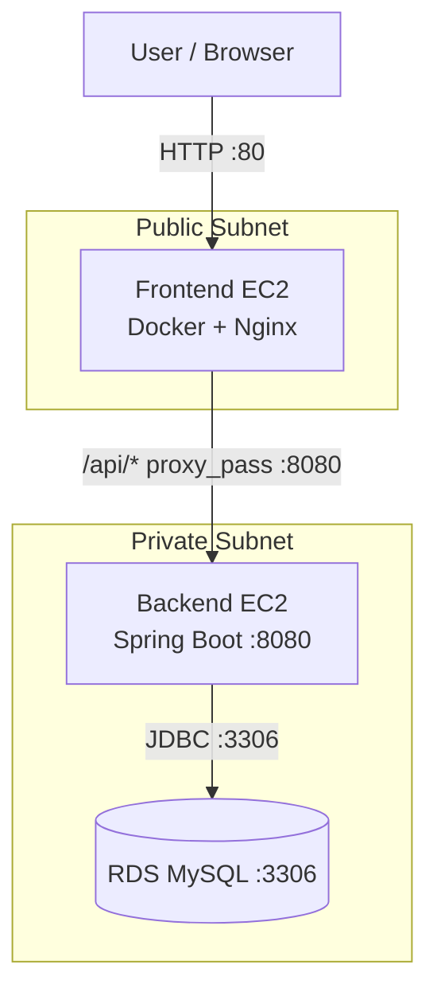
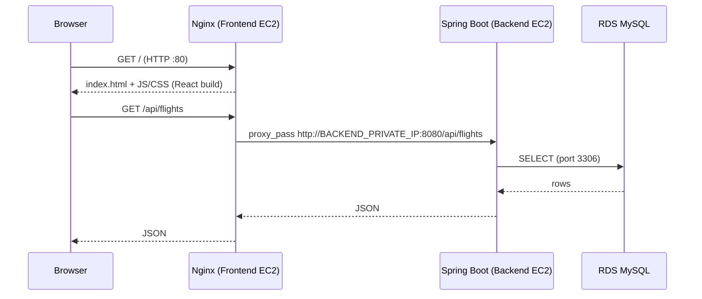
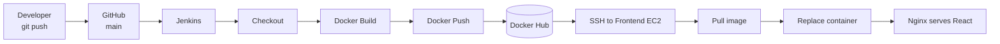

# FlightFinder Frontend — CI/CD Deployment Runbook


<p align="center">
  
</p>

> **Document type:** Operations runbook
> **Scope:** Frontend build, release, verification, rollback, troubleshooting
> **Audience:** DevOps engineers, reviewers, interviewers

---

## Table of Contents

1. [Project Summary](#1-project-summary)
2. [Architecture](#2-architecture)
3. [Request Flow](#3-request-flow)
4. [CI/CD Pipeline](#4-cicd-pipeline)
5. [Environment Reference](#5-environment-reference)
6. [Container Build](#6-container-build)
7. [Nginx Reverse Proxy](#7-nginx-reverse-proxy)
8. [Jenkins Configuration](#8-jenkins-configuration)
9. [Jenkinsfile](#9-jenkinsfile)
10. [Deployment Procedure](#10-deployment-procedure)
11. [Verification](#11-verification)
12. [Rollback](#12-rollback)
13. [Troubleshooting](#13-troubleshooting)
14. [Security Notes](#14-security-notes)
15. [Checklists](#15-checklists)
16. [Project Explanation](#16-project-explanation)

---

## 1. Project Summary

FlightFinder is a three-tier application on AWS. This runbook covers the **frontend** (React + Vite), which is built into a Docker image, published to Docker Hub, and deployed by Jenkins to a public EC2 instance running Nginx.

| Tier | Technology | Location | Port |
| --- | --- | --- | --- |
| Frontend | React (Vite), Nginx, Docker | Public subnet, EC2 | 80 |
| Backend | Spring Boot (Java 21) | Private subnet, EC2 | 8080 |
| Database | RDS MySQL | Private subnet | 3306 |

**Design goal:** only the frontend is exposed to the internet. Backend and database stay private; Nginx proxies `/api/*` to the backend.

---

## 2. Architecture



---

## 3. Request Flow

How a live user request enters, is served, and returns.



| Step | Component | Action |
| --- | --- | --- |
| 1 | Browser | Requests the site on port 80 |
| 2 | Nginx | Serves static React files from `/usr/share/nginx/html` |
| 3 | React | Calls the API with relative paths such as `/api/flights` |
| 4 | Nginx | Matches `location /api/` and forwards to the private backend |
| 5 | Spring Boot | Processes the request and queries RDS |
| 6 | Response | Returns along the same path; the backend IP is never exposed |

---

## 4. CI/CD Pipeline



| Stage | Description |
| --- | --- |
| Checkout | Pull `main` from GitHub |
| Docker Build | Multi-stage build; tag `:<BUILD_NUMBER>` and `:latest` |
| Docker Push | Push both tags to Docker Hub |
| Deploy | SSH to frontend EC2, pull new tag, stop and remove old container, run new one |

---

## 5. Environment Reference

| Item | Value |
| --- | --- |
| Repository | `https://github.com/ajaydhadi95-gif/-FlightFinder-frontend-React.git` |
| Branch | `main` |
| Docker image | `ajaydhadi95/flightfinder-frontend` |
| Container name | `flightfinder-frontend` |
| Frontend EC2 (public IP) | `13.200.254.41` |
| Frontend EC2 (private IP) | `10.0.1.233` |
| Backend EC2 (private IP) | `10.0.11.171` |
| SSH user | `ubuntu` |
| Jenkins credentials | `dockerhub-credentials`, `frontend-ec2-ssh` |
| Site URL | `http://13.200.254.41` |

> **Note:** the image name must be identical in the Jenkinsfile, Docker Hub, and every manual command. Use the Jenkinsfile value as the source of truth.

Repository layout:

```text
frontend/
├── src/
├── public/
├── package.json
├── package-lock.json
├── Dockerfile
├── nginx.conf
├── .dockerignore
└── Jenkinsfile
```

---

## 6. Container Build

Multi-stage `Dockerfile`: Node builds the app, Nginx serves it.

```dockerfile
FROM node:22-alpine AS builder
WORKDIR /app
COPY package*.json ./
RUN npm ci
COPY . .
RUN npm run build

FROM nginx:alpine
COPY --from=builder /app/dist /usr/share/nginx/html
COPY nginx.conf /etc/nginx/conf.d/default.conf
EXPOSE 80
CMD ["nginx", "-g", "daemon off;"]
```

| Instruction | Purpose |
| --- | --- |
| `npm ci` | Reproducible dependency install from the lockfile |
| `npm run build` | Produces the production bundle in `/app/dist` |
| `COPY --from=builder` | Copies only the build output; Node is not in the final image |
| `COPY nginx.conf` | Adds SPA routing and the `/api/` proxy |

`.dockerignore`:

```text
node_modules
dist
.git
.gitignore
README.md
Dockerfile
.dockerignore
```

---

## 7. Nginx Reverse Proxy

```nginx
server {
    listen 80;
    server_name _;

    root /usr/share/nginx/html;
    index index.html;

    location / {
        try_files $uri /index.html;
    }

    location /api/ {
        proxy_pass http://10.0.11.171:8080;

        proxy_set_header Host $host;
        proxy_set_header X-Real-IP $remote_addr;
        proxy_set_header X-Forwarded-For $proxy_add_x_forwarded_for;
        proxy_set_header X-Forwarded-Proto $scheme;
    }
}
```

- `try_files $uri /index.html` lets React Router handle client-side routes such as `/flights`.
- `/api/` forwards to the private backend, so the browser never needs its address.

React code must use **relative** API paths:

```javascript
fetch("/api/flights")                          // correct
fetch("http://10.0.11.171:8080/api/flights")   // wrong: private IP unreachable
fetch("http://localhost:8080/api/flights")     // wrong: resolves to the user's machine
```

> **Pre-release check:** confirm `10.0.11.171` is still the backend private IP (`hostname -I` on the backend). If it changed, update `nginx.conf` **before** building. For production, prefer a stable private DNS name or internal load balancer over a hard-coded IP.

---

## 8. Jenkins Configuration

**Jenkins server:** Java 21, Git, Docker, AWS CLI, Jenkins.

```bash
sudo systemctl status jenkins
sudo -u jenkins docker ps
```

**Credentials**

| ID | Type | Notes |
| --- | --- | --- |
| `dockerhub-credentials` | Username with password | Password is a Docker Hub **access token** |
| `frontend-ec2-ssh` | SSH username with private key | Username `ubuntu`; full key including BEGIN/END lines |

**SSH trust:** the Jenkins key pair's public key (`~/.ssh/id_ed25519.pub`) is in `~/.ssh/authorized_keys` on the frontend EC2. Never commit private keys to Git.

Manual test from the Jenkins server:

```bash
ssh -i ~/.ssh/id_ed25519 ubuntu@13.200.254.41
```

---

## 9. Jenkinsfile

```groovy
pipeline {
    agent any

    environment {
        IMAGE_NAME   = 'ajaydhadi95/flightfinder-frontend'
        IMAGE_TAG    = "${BUILD_NUMBER}"
        FRONTEND_EC2 = '13.200.254.41'
    }

    stages {
        stage('Checkout') {
            steps {
                git branch: 'main',
                    url: 'https://github.com/ajaydhadi95-gif/-FlightFinder-frontend-React.git'
            }
        }

        stage('Docker Build') {
            steps {
                sh "docker build -t ${IMAGE_NAME}:${IMAGE_TAG} ."
                sh "docker tag ${IMAGE_NAME}:${IMAGE_TAG} ${IMAGE_NAME}:latest"
            }
        }

        stage('Docker Push') {
            steps {
                withCredentials([usernamePassword(
                    credentialsId: 'dockerhub-credentials',
                    usernameVariable: 'DOCKER_USERNAME',
                    passwordVariable: 'DOCKER_PASSWORD')]) {
                    sh '''
                        echo "$DOCKER_PASSWORD" | docker login \
                        -u "$DOCKER_USERNAME" --password-stdin
                    '''
                    sh "docker push ${IMAGE_NAME}:${IMAGE_TAG}"
                    sh "docker push ${IMAGE_NAME}:latest"
                }
            }
        }

        stage('Deploy to Frontend EC2') {
            steps {
                withCredentials([sshUserPrivateKey(
                    credentialsId: 'frontend-ec2-ssh',
                    keyFileVariable: 'SSH_KEY',
                    usernameVariable: 'SSH_USER')]) {
                    sh """
                        ssh -o StrictHostKeyChecking=no \
                            -i "\$SSH_KEY" \
                            "\$SSH_USER@${FRONTEND_EC2}" '
                            docker pull ${IMAGE_NAME}:${IMAGE_TAG}
                            docker stop flightfinder-frontend || true
                            docker rm flightfinder-frontend || true
                            docker run -d \
                                --restart unless-stopped \
                                --name flightfinder-frontend \
                                -p 80:80 \
                                ${IMAGE_NAME}:${IMAGE_TAG}
                            docker ps
                        '
                    """
                }
            }
        }
    }

    post {
        success { echo 'FlightFinder Frontend deployed successfully!' }
        failure { echo 'FlightFinder Frontend deployment failed!' }
    }
}
```

---

## 10. Deployment Procedure

1. Commit and push to `main`.
2. In Jenkins, run the pipeline (or let the trigger start it).
3. Watch the four stages: Checkout, Docker Build, Docker Push, Deploy.
4. Confirm `SUCCESS`, then run the [verification](#11-verification) steps.

---

## 11. Verification

On the frontend EC2:

```bash
docker ps                                           # flightfinder-frontend, 0.0.0.0:80->80/tcp
docker exec flightfinder-frontend nginx -t          # syntax is ok / test is successful
docker exec flightfinder-frontend cat /etc/nginx/conf.d/default.conf
docker logs flightfinder-frontend
```

From any machine:

```bash
curl http://13.200.254.41/api/test      # FlightFinder Backend is running!
curl http://13.200.254.41/api/flights   # JSON array
```

Then open `http://13.200.254.41` and confirm the UI loads.

---

## 12. Rollback

Every build produces a versioned image. To revert from build 5 to build 4:

```bash
docker pull ajaydhadi95/flightfinder-frontend:4
docker stop flightfinder-frontend
docker rm flightfinder-frontend
docker run -d \
    --restart unless-stopped \
    --name flightfinder-frontend \
    -p 80:80 \
    ajaydhadi95/flightfinder-frontend:4
docker ps
```

---

## 13. Troubleshooting

| Symptom | Likely cause | Fix |
| --- | --- | --- |
| `permission denied ... Docker daemon` in Jenkins | `jenkins` user not in `docker` group | `sudo usermod -aG docker jenkins && sudo systemctl restart jenkins`, then `sudo -u jenkins docker ps` |
| `Permission denied (publickey)` | Wrong key or missing `authorized_keys` entry | Test SSH manually; check `~/.ssh/authorized_keys`; check `frontend-ec2-ssh` |
| `Load key ... error in libcrypto` | Malformed private key stored in Jenkins | Re-add the complete key with BEGIN/END lines; test manually; re-run |
| Website does not open | Port 80 blocked or container down | Allow TCP 80 in the security group; `docker ps`; `sudo ss -tulpn \| grep :80`; `docker logs flightfinder-frontend` |
| `/api/*` fails | Nginx config or backend unreachable | `curl /api/test`; `nginx -t`; from frontend EC2 run `curl http://10.0.11.171:8080/api/test`; check backend app, security group, IP, port 8080, routing |
| Page refresh on `/flights` gives 404 | Missing SPA fallback | Ensure `try_files $uri /index.html;` is present |

---

## 14. Security Notes

**Intended security-group flow**

| Resource | Port | Allowed source |
| --- | --- | --- |
| Frontend EC2 | 80 | Internet |
| Backend EC2 | 8080 | Frontend security group |
| RDS MySQL | 3306 | Backend security group |

Recommended hardening:

- Do not expose backend port 8080 to the internet.
- Replace `StrictHostKeyChecking=no` with a pinned host key in `known_hosts`.
- Use Docker Hub access tokens, never account passwords.
- Add HTTPS (ACM with a load balancer, or Let's Encrypt on Nginx) in place of plain HTTP.
- Replace the hard-coded backend IP with private DNS.
- Prefer SSM over SSH for deployment where possible.

---

## 15. Checklists

**Before deployment**

- [ ] GitHub code is up to date
- [ ] `Dockerfile` and `nginx.conf` are correct
- [ ] React uses relative `/api/` paths
- [ ] Backend private IP in `nginx.conf` is current
- [ ] Jenkins is running and can use Docker
- [ ] Docker Hub and SSH credentials exist in Jenkins
- [ ] Frontend EC2 is running; port 80 allowed
- [ ] Backend port 8080 allows the frontend security group

**After deployment**

- [ ] Jenkins build is `SUCCESS`
- [ ] Image pushed to Docker Hub
- [ ] Container running on frontend EC2
- [ ] `nginx -t` passes
- [ ] Website loads
- [ ] `/api/test` and `/api/flights` respond

---

## 16. Project Explanation

**Short version**

> I built a CI/CD pipeline for the FlightFinder React frontend using GitHub, Jenkins, Docker, Docker Hub, and AWS EC2. On every release, Jenkins builds a multi-stage Docker image, pushes a versioned tag to Docker Hub, then connects to the public EC2 over SSH to replace the running container. Nginx serves the React app on port 80 and acts as a reverse proxy, forwarding `/api` requests to the Spring Boot backend in a private subnet, which talks to RDS MySQL. Only the frontend is internet-facing.

**Key talking points**

| Topic | Point |
| --- | --- |
| Why Docker | Consistent, repeatable deployments; no Node.js on the server |
| Why multi-stage | Small final image containing only Nginx and static files |
| Why a reverse proxy | Backend is private; the browser cannot reach it directly |
| Why versioned tags | One-command rollback to any earlier build |
| Why private backend and DB | Smaller attack surface; security groups chain frontend, backend, RDS |

**One line:** a GitHub-to-Jenkins-to-Docker pipeline deploys a React frontend on EC2 with Nginx, which securely proxies to a private Spring Boot backend.
