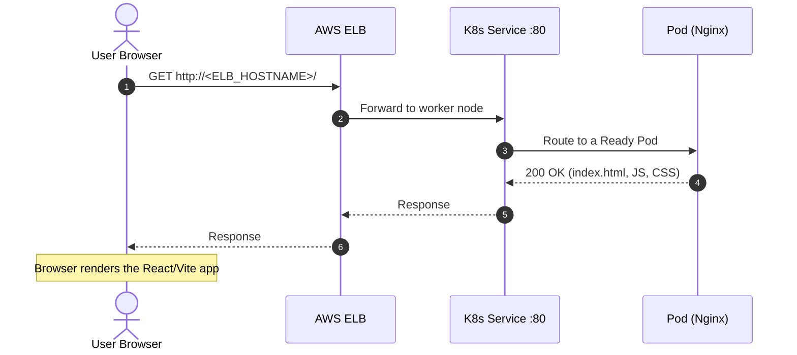
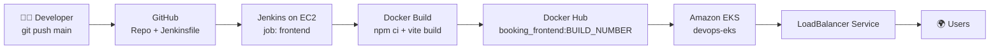
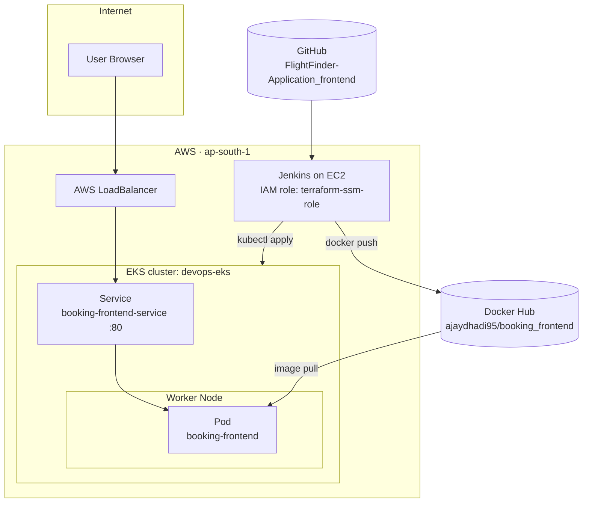

<div align="center">

# ✈️ FlightFinder Frontend — CI/CD on Amazon EKS

**React + Vite frontend, built by Jenkins, packaged with Docker, stored on Docker Hub and served from Amazon EKS behind an AWS LoadBalancer.**


   <!DOCTYPE html>
<html lang="hi">
<head>
<meta charset="utf-8">
<meta name="viewport" content="width=device-width, initial-scale=1, viewport-fit=cover">
<title>Live AWS Infrastructure - devops-vpc</title>
<style>
:root{box-sizing:border-box;padding-top:env(safe-area-inset-top,0px);padding-bottom:env(safe-area-inset-bottom,0px);
--bg:#f8fafc;--card:#fff;--tx:#0f172a;--mu:#64748b;--ln:#cbd5e1;--vpc:#eef2ff;--pub:#e0f2fe;--prv:#dcfce7;--db:#f3e8ff;
--c1:#0284c7;--c2:#16a34a;--c3:#7c3aed;--c4:#ea580c;--c5:#64748b}
@media (prefers-color-scheme:dark){:root:not([data-theme="light"]){--bg:#0b1220;--card:#1e293b;--tx:#e2e8f0;--mu:#94a3b8;--ln:#334155;--vpc:#111a33;--pub:#0c2a3d;--prv:#0f2e22;--db:#2a1a45;--c1:#38bdf8;--c2:#4ade80;--c3:#a78bfa;--c4:#fb923c;--c5:#94a3b8}}
:root[data-theme="dark"]{--bg:#0b1220;--card:#1e293b;--tx:#e2e8f0;--mu:#94a3b8;--ln:#334155;--vpc:#111a33;--pub:#0c2a3d;--prv:#0f2e22;--db:#2a1a45;--c1:#38bdf8;--c2:#4ade80;--c3:#a78bfa;--c4:#fb923c;--c5:#94a3b8}
html{scroll-padding-top:env(safe-area-inset-top,0px)}
body{margin:0;background:var(--bg);color:var(--tx);font-family:system-ui,-apple-system,"Segoe UI",Roboto,sans-serif}
main{max-width:1000px;margin:0 auto;padding:16px}
h1{font-size:1.25rem;margin:4px 0}
p.sub{color:var(--mu);margin:0 0 12px;font-size:.9rem}
.wrap{overflow-x:auto;background:var(--card);border:1px solid var(--ln);border-radius:14px;padding:6px}
svg{display:block;min-width:720px;width:100%;height:auto}
svg text{fill:var(--tx);font-family:inherit}
.t{font-size:12px;font-weight:700}.s{font-size:10px;fill:var(--mu)}
.box{fill:var(--card);stroke:var(--ln);stroke-width:1.5}
.flows{display:grid;grid-template-columns:repeat(auto-fit,minmax(220px,1fr));gap:10px;margin-top:12px}
.f{background:var(--card);border:1px solid var(--ln);border-radius:12px;padding:10px 12px;font-size:.85rem;line-height:1.4}
.f b{display:flex;align-items:center;gap:6px;margin-bottom:3px}
.d{width:10px;height:10px;border-radius:50%;display:inline-block}
button{margin-top:10px;background:var(--card);color:var(--tx);border:1px solid var(--ln);border-radius:8px;padding:6px 12px;cursor:pointer}
</style>
</head>
<body>
<main>
<h1>☁️ Live AWS Infrastructure — devops-vpc (ap-south-1)</h1>
<p class="sub">Terraform state se bana: user kaise andar aata hai, response kaise wapas jaata hai, DB aur internet tak ka raasta.</p>
<div class="wrap">
<svg id="sv" viewBox="0 0 900 570" role="img" aria-label="Animated AWS infrastructure traffic flow">
 <rect x="150" y="14" width="740" height="520" rx="14" fill="var(--vpc)" stroke="var(--ln)" stroke-width="1.5"/>
 <text class="t" x="166" y="34">VPC · devops-vpc · 10.0.0.0/16</text>
 <!-- tiers -->
 <rect x="168" y="46" width="706" height="134" rx="10" fill="var(--pub)" stroke="var(--ln)"/>
 <text class="s" x="180" y="62">Public subnet · 10.0.1.0/24 · ap-south-1a</text>
 <rect x="168" y="196" width="706" height="156" rx="10" fill="var(--prv)" stroke="var(--ln)"/>
 <text class="s" x="180" y="212">Private subnets · EKS devops-eks · route 0.0.0.0/0 → NAT</text>
 <rect x="168" y="368" width="706" height="154" rx="10" fill="var(--db)" stroke="var(--ln)"/>
 <text class="s" x="180" y="384">Database subnets · 10.0.21.0/24 (1a) · 10.0.22.0/24 (1b) · no internet route</text>
 <!-- outside -->
 <rect class="box" x="14" y="70" width="104" height="70" rx="10"/><text class="t" x="66" y="100" text-anchor="middle">🌍 Users</text><text class="s" x="66" y="118" text-anchor="middle">Browser</text>
 <rect class="box" x="14" y="200" width="104" height="60" rx="10"/><text class="t" x="66" y="226" text-anchor="middle">🐳 Docker Hub</text><text class="s" x="66" y="244" text-anchor="middle">image pull</text>
 <rect class="box" x="132" y="86" width="40" height="38" rx="8" stroke="var(--c1)"/><text class="t" x="152" y="110" text-anchor="middle">IGW</text>
 <!-- public -->
 <rect class="box" x="230" y="82" width="120" height="62" rx="10" stroke="var(--c1)"/><text class="t" x="290" y="108" text-anchor="middle">AWS Load Balancer</text><text class="s" x="290" y="126" text-anchor="middle">port 80 / 443</text>
 <rect class="box" x="470" y="82" width="110" height="62" rx="10" stroke="var(--c4)"/><text class="t" x="525" y="108" text-anchor="middle">NAT Gateway</text><text class="s" x="525" y="126" text-anchor="middle">outbound only</text>
 <rect class="box" x="700" y="82" width="140" height="62" rx="10" stroke="var(--c5)"/><text class="t" x="770" y="108" text-anchor="middle">Jenkins EC2</text><text class="s" x="770" y="126" text-anchor="middle">:8080 · SSM role</text>
 <!-- private -->
 <rect class="box" x="196" y="224" width="310" height="112" rx="10"/><text class="s" x="208" y="240">Worker node · 10.0.11.0/24 · 1a</text>
 <rect class="box" x="226" y="256" width="170" height="46" rx="8" stroke="var(--c3)"/><text class="t" x="311" y="276" text-anchor="middle">Backend Pod</text><text class="s" x="311" y="291" text-anchor="middle">Spring Boot :8080</text>
 <rect class="box" x="530" y="224" width="326" height="112" rx="10"/><text class="s" x="542" y="240">Worker node · 10.0.12.0/24 · 1b</text>
 <rect class="box" x="560" y="256" width="250" height="46" rx="8" stroke="var(--c2)"/><text class="t" x="685" y="276" text-anchor="middle">booking-frontend Pod (Nginx :80)</text><text class="s" x="685" y="291" text-anchor="middle">10.0.12.164 · Service booking-frontend-service</text>
 <!-- db -->
 <rect class="box" x="240" y="404" width="260" height="84" rx="10" stroke="var(--c3)"/><text class="t" x="370" y="430" text-anchor="middle">🗄️ RDS MySQL 8.0 · devops-mysql</text><text class="s" x="370" y="448" text-anchor="middle">db: bookingdb · :3306 · encrypted · not public</text><text class="s" x="370" y="464" text-anchor="middle">SG: only EKS node SG can connect</text>
 <text class="s" x="560" y="440">🔒 DB sirf private traffic leta hai</text>
 <text class="s" x="560" y="456">Internet se seedha koi raasta nahi</text>
 <!-- guide paths -->
 <g fill="none" stroke-width="1.5" stroke-dasharray="4 5" opacity=".55">
  <path id="req" stroke="var(--c1)" d="M118,105 L150,105 L232,112 L290,125 L360,190 L650,262"/>
  <path id="res" stroke="var(--c2)" d="M660,272 L370,202 L305,140 L240,124 L150,118 L118,118"/>
  <path id="dbq" stroke="var(--c3)" d="M290,302 L290,378 L330,410"/>
  <path id="dbr" stroke="var(--c3)" d="M350,410 L312,378 L312,302"/>
  <path id="egr" stroke="var(--c4)" d="M700,262 L545,146 L525,64 L152,64 L152,86 L90,200"/>
  <path id="jk" stroke="var(--c5)" d="M770,144 L770,200 L740,258"/>
 </g>
 <g id="dots"></g>
</svg>
</div>
<div class="flows">
 <div class="f"><b><span class="d" style="background:var(--c1)"></span>1 · User aata hai</b>Browser → IGW → Load Balancer → Service → frontend Pod (Nginx :80)</div>
 <div class="f"><b><span class="d" style="background:var(--c2)"></span>2 · Response jaata hai</b>Pod → Load Balancer → IGW → User ka browser (index.html + JS/CSS)</div>
 <div class="f"><b><span class="d" style="background:var(--c3)"></span>3 · Database</b>Backend Pod → RDS :3306 aur data wapas. DB private subnet me hai.</div>
 <div class="f"><b><span class="d" style="background:var(--c4)"></span>4 · Pod → Internet</b>Private Pod → NAT Gateway → IGW → Docker Hub (image pull).</div>
 <div class="f"><b><span class="d" style="background:var(--c5)"></span>5 · Deploy</b>Jenkins kubectl se EKS me Deployment update karta hai.</div>
</div>
<button id="pp" type="button">⏸ Pause</button>
</main>
<script>
(function(){
var ns="http://www.w3.org/2000/svg",g=document.getElementById("dots"),sv=document.getElementById("sv");
// id, colour var, duration, phase (0 = first half, 1 = second half, 2 = full loop), dots
var F=[["req","--c1",8,0,2],["res","--c2",8,1,2],["dbq","--c3",8,0,1],["dbr","--c3",8,1,1],["egr","--c4",8,1,1],["jk","--c5",8,0,1]];
F.forEach(function(f){
 for(var i=0;i<f[4];i++){
  var c=document.createElementNS(ns,"circle");c.setAttribute("r","6");c.setAttribute("fill","var("+f[1]+")");
  c.setAttribute("stroke","var(--card)");c.setAttribute("stroke-width","2");
  var dur=f[2],off=(i*dur/ (f[4]*2)).toFixed(2);
  var a=document.createElementNS(ns,"animateMotion");
  a.setAttribute("dur",dur+"s");a.setAttribute("repeatCount","indefinite");a.setAttribute("begin","-"+off+"s");
  a.setAttribute("calcMode","linear");
  a.setAttribute("keyPoints",f[3]==0?"0;1;1":"0;0;1");a.setAttribute("keyTimes","0;.5;1");
  var m=document.createElementNS(ns,"mpath");m.setAttributeNS("http://www.w3.org/1999/xlink","href","#"+f[0]);m.setAttribute("href","#"+f[0]);
  a.appendChild(m);c.appendChild(a);
  var o=document.createElementNS(ns,"animate");o.setAttribute("attributeName","opacity");o.setAttribute("dur",dur+"s");
  o.setAttribute("repeatCount","indefinite");o.setAttribute("begin","-"+off+"s");
  o.setAttribute("values",f[3]==0?"1;1;0;0":"0;0;1;1");o.setAttribute("keyTimes","0;.49;.5;1");o.setAttribute("calcMode","discrete");
  c.appendChild(o);g.appendChild(c);
 }
});
var b=document.getElementById("pp"),paused=false;
b.addEventListener("click",function(){paused=!paused;paused?sv.pauseAnimations():sv.unpauseAnimations();b.textContent=paused?"▶ Play":"⏸ Pause"});
})();
</script>
</body>
</html>


<sub>👆 Live user flow — a visitor's request travelling to the Pod and the response coming back.</sub>

</div>

---

## 📑 Table of Contents

1. [Overview](#-overview)
2. [User Flow (how users come and go)](#-user-flow-how-users-come-and-go)
3. [CI/CD Flow](#-cicd-flow)
4. [Architecture](#-architecture)
5. [Tech Stack](#-tech-stack)
6. [Project Configuration](#-project-configuration)
7. [Repository Structure](#-repository-structure)
8. [Prerequisites](#-prerequisites)
9. [Setup Guide](#-setup-guide)
10. [Jenkins Pipeline Stages](#-jenkins-pipeline-stages)
11. [Deployment Commands](#-deployment-commands)
12. [Verify the Deployment](#-verify-the-deployment)
13. [Troubleshooting](#-troubleshooting)
14. [Security Notes](#-security-notes)
15. [Roadmap](#-roadmap)
16. [Author](#-author)

---

## 🔎 Overview

This project automatically deploys the **FlightFinder** React/Vite frontend to **Amazon EKS**.

| Tool | Role |
|------|------|
| **GitHub** | Stores the source code and `Jenkinsfile` |
| **Jenkins (on EC2)** | Runs the automated build and deploy pipeline |
| **Docker** | Packages the app into a multi-stage image (Node build → Nginx runtime) |
| **Docker Hub** | Stores the built image |
| **Amazon EKS** | Runs the containers using Kubernetes |
| **AWS LoadBalancer** | Gives users an external entry point |
| **Browser** | Where the user opens the website |

---

## 🌐 User Flow (how users come and go)

<div align="center">

</div>

**Request path (user comes in):**

1. The user opens the LoadBalancer URL in the browser → `HTTP GET /`
2. The **AWS ELB** forwards the traffic to a healthy EKS worker node
3. The **Kubernetes Service** (`booking-frontend-service`, port `80`) picks a Ready Pod
4. **Nginx** inside the Pod serves the built Vite files from `dist/`

**Response path (user gets the page):**

5. Nginx returns `index.html` + JS/CSS (`200 OK`)
6. The response goes back through the Service and the ELB
7. The browser renders the React UI



---

## 🔁 CI/CD Flow

<div align="center">

</div>



> ⚠️ A push to GitHub starts the pipeline **only if** a webhook or polling trigger is configured. See the [Roadmap](#-roadmap).

---

## 🏗️ Architecture



---

## 🧰 Tech Stack

- **Frontend:** React, Vite, Node.js 22
- **Web server:** Nginx (Alpine)
- **Containerization:** Docker (multi-stage build)
- **CI/CD:** Jenkins (Pipeline script from SCM)
- **Registry:** Docker Hub
- **Orchestration:** Kubernetes on Amazon EKS
- **Cloud:** AWS (EC2, IAM, EKS, ELB) in `ap-south-1`

---

## ⚙️ Project Configuration

| Component | Value |
|-----------|-------|
| AWS Region | `ap-south-1` |
| Jenkins job | `frontend` |
| Jenkins workspace | `/var/lib/jenkins/workspace/frontend` |
| GitHub repository | `FlightFinder-Application_frontend` |
| Git branch | `main` |
| EKS cluster | `devops-eks` |
| Docker Hub image | `ajaydhadi95/booking_frontend:<BUILD_NUMBER>` |
| Kubernetes Deployment | `booking-frontend` |
| Kubernetes Service | `booking-frontend-service` |
| Service type / port | `LoadBalancer` / `80` |
| Jenkins IAM role | `terraform-ssm-role` |

---

## 📂 Repository Structure

```text
FlightFinder-Application_frontend/
├── Jenkinsfile          # CI/CD pipeline definition
├── Dockerfile           # Multi-stage build (Node → Nginx)
├── nginx.conf           # Nginx config for serving the SPA
├── package.json         # Dependencies and scripts
├── src/                 # React/Vite source code
├── README.md
└── docs/
    └── images/
        ├── user-flow.gif    # Animated user request/response flow
        └── cicd-flow.gif    # Animated CI/CD flow
```

---

## ✅ Prerequisites

On the **Jenkins EC2 instance**:

```bash
git --version
docker --version
aws --version
kubectl version --client
java -version
```

Also required:

- Jenkins credential `dockerhub-credentials` (username + access token)
- An IAM role on the EC2 instance that can call the EKS APIs
- Kubernetes access for the Jenkins user inside the cluster (IAM and Kubernetes permissions are **separate**)

---

## 🚀 Setup Guide

### 1. Confirm AWS identity and cluster status

```bash
aws sts get-caller-identity

aws eks describe-cluster \
  --region ap-south-1 \
  --name devops-eks \
  --query "cluster.status" \
  --output text        # expected: ACTIVE
```

### 2. Create the kubeconfig

```bash
aws eks update-kubeconfig \
  --region ap-south-1 \
  --name devops-eks
```

### 3. Give the `jenkins` Linux user its own kubeconfig

Jenkins runs jobs as the `jenkins` user, not as `ubuntu`.

```bash
sudo mkdir -p /var/lib/jenkins/.kube

sudo cp /home/ubuntu/.kube/config \
  /var/lib/jenkins/.kube/config

sudo chown -R jenkins:jenkins /var/lib/jenkins/.kube
sudo chmod 700 /var/lib/jenkins/.kube
sudo chmod 600 /var/lib/jenkins/.kube/config
```

Test it as the Jenkins user:

```bash
sudo -u jenkins env KUBECONFIG=/var/lib/jenkins/.kube/config kubectl get nodes
sudo -u jenkins env KUBECONFIG=/var/lib/jenkins/.kube/config kubectl get pods -A
```

Both worker nodes should show `Ready`.

### 4. Create the Jenkins job

- Type: **Pipeline**
- Definition: **Pipeline script from SCM**
- Repository: `FlightFinder-Application_frontend`
- Branch: `main`
- Script path: `Jenkinsfile`

---

## 🧪 Jenkins Pipeline Stages

| # | Stage | Purpose |
|---|-------|---------|
| 1 | **Checkout** | `checkout scm` — get code from the same repo the job uses |
| 2 | **Verify Project** | `test -f package.json`, `Dockerfile`, `nginx.conf` |
| 3 | **Build Docker Image** | `docker build -t ajaydhadi95/booking_frontend:$BUILD_NUMBER .` |
| 4 | **Push Image to Docker Hub** | Login with stored credentials, `docker push`, `docker logout` |
| 5 | **Connect to EKS** | Configure and test cluster access |
| 6 | **Deploy to EKS** | Create/update the Deployment and Service, wait for rollout |

Secure Docker Hub login used in the pipeline:

```groovy
withCredentials([
    usernamePassword(
        credentialsId: 'dockerhub-credentials',
        usernameVariable: 'DOCKERHUB_USER',
        passwordVariable: 'DOCKERHUB_TOKEN'
    )
]) {
    sh '''
        echo "$DOCKERHUB_TOKEN" | docker login \
          -u "$DOCKERHUB_USER" \
          --password-stdin

        docker push ${IMAGE_NAME}:${IMAGE_TAG}

        docker logout
    '''
}
```

---

## ☸️ Deployment Commands

**Create or update the Deployment**

```bash
kubectl create deployment booking-frontend \
  --image=ajaydhadi95/booking_frontend:<TAG> \
  --dry-run=client -o yaml | kubectl apply -f -
```

**Update the image** (the container name on the left must match the *actual container name*, not just the Deployment name)

```bash
kubectl get deployment booking-frontend \
  -o jsonpath='{.spec.template.spec.containers[0].name}'

kubectl set image deployment/booking-frontend \
  <CONTAINER_NAME>=ajaydhadi95/booking_frontend:<TAG>
```

**Wait for the rollout**

```bash
kubectl rollout status deployment/booking-frontend --timeout=180s
```

**Expose through a LoadBalancer**

```bash
kubectl expose deployment booking-frontend \
  --name=booking-frontend-service \
  --type=LoadBalancer \
  --port=80 \
  --target-port=80 \
  --dry-run=client -o yaml | kubectl apply -f -
```

---

## 🔍 Verify the Deployment

```bash
kubectl get nodes
kubectl get deployments
kubectl get pods -o wide
kubectl get svc booking-frontend-service
kubectl get svc booking-frontend-service -w     # watch until EXTERNAL-IP is assigned
```

Healthy output looks like:

| Check | Expected |
|-------|----------|
| Nodes | `Ready` |
| Pod | `1/1  Running` |
| Service | `TYPE: LoadBalancer` with an `EXTERNAL-IP` hostname |

Finally, open it in your browser:

```text
http://<ELB_HOSTNAME>
```

> The hostname being assigned does not guarantee the site is reachable yet. **The browser test is the final check**, including any API-dependent features.

---

## 🛠️ Troubleshooting

| Problem | What to check / fix |
|---------|---------------------|
| Jenkins can't reach Kubernetes | Make sure `/var/lib/jenkins/.kube/config` exists and is owned by `jenkins` |
| AWS auth errors | `aws sts get-caller-identity` — verify the EC2 IAM role |
| `Project files verified` fails | Confirm `package.json`, `Dockerfile`, `nginx.conf` exist and the right repo is checked out |
| `error: unable to find container named "booking-frontend"` | Deployment name ≠ container name. Read it with the `jsonpath` command above |
| Image can't be pulled | Confirm the push succeeded (`digest: sha256:...`) and the tag matches |
| Docker credentials warning | Security warning about `/var/lib/jenkins/.docker/config.json`, **not** a failed push |
| Site not loading | Wait for ELB provisioning, then check `kubectl get svc` and `kubectl describe svc booking-frontend-service` |

Useful debugging commands:

```bash
kubectl describe pod <POD_NAME>
kubectl logs deployment/booking-frontend
kubectl logs deployment/booking-frontend --previous
kubectl describe deployment booking-frontend
kubectl describe svc booking-frontend-service
```

---

## 🔐 Security Notes

- Never commit Docker Hub passwords/tokens — use Jenkins credentials (`withCredentials`).
- Use `--password-stdin` for `docker login`, and `docker logout` after the push.
- Keep kubeconfig permissions strict (`700` directory, `600` file).
- Restrict the Jenkins port (`8080`) in the EC2 security group to trusted IPs.
- Use least-privilege IAM and Kubernetes RBAC for the Jenkins role.
- Don't publish real Jenkins IPs or LoadBalancer hostnames in a public README.

---

## 🗺️ Roadmap

- [ ] GitHub webhook trigger so a `git push` starts the pipeline automatically
- [ ] HTTPS with ACM + Ingress (AWS Load Balancer Controller) and a custom domain
- [ ] Replace `latest`-style manual tagging with immutable tags + automatic rollback on failed rollout
- [ ] Add readiness/liveness probes and resource requests/limits
- [ ] Horizontal Pod Autoscaler for traffic spikes
- [ ] Move manifests into versioned YAML / Helm chart

---

## 👤 Author

**Ajay Dhadi** — AWS · DevOps · Cloud · Infrastructure as Code

GitHub: [@ajaydhadi95-gif](https://github.com/ajaydhadi95-gif)

---

<div align="center">

⭐ If this runbook helped you, give the repo a star!

</div>
